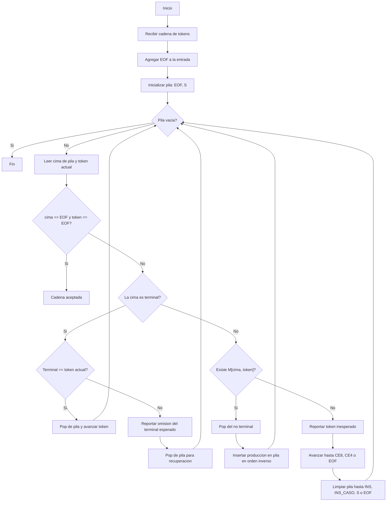

# Analizador sintactico LL(1) para COND

Este documento resume la logica que se puede pasar a PDF para la evidencia del analizador sintactico de condiciones de GatoSabe.

## Tipo de analizador

Analizador sintactico descendente predictivo LL(1), tambien conocido como top-down LL(1).

Entrada:
- Gramatica de condicion.
- Cadena de tokens, por ejemplo: `IDV OPR6 CNU OPL1 IDV OPR1 PR20 EOF`.

Salida:
- Acepta la cadena si la pila y la entrada llegan juntas a `EOF`.
- Reporta error sintactico si no existe produccion en la tabla M o si el terminal esperado no coincide.

## Gramatica usada para condiciones

```txt
COND       -> COND_OR
COND_OR    -> COND_AND COND_OR_P
COND_OR_P  -> OPL2 COND_AND COND_OR_P | e
COND_AND   -> COND_NOT COND_AND_P
COND_AND_P -> OPL1 COND_NOT COND_AND_P | e
COND_NOT   -> OPL3 COND_NOT | COND_REL
COND_REL   -> EXP_COND REL_OPC
REL_OPC    -> OPR1 EXP_COND | OPR2 EXP_COND | OPR3 EXP_COND | OPR4 EXP_COND | OPR5 EXP_COND | OPR6 EXP_COND | e
```

La condicion usa niveles aritmeticos con sufijo `_COND`. Comparten la jerarquia de las expresiones de asignacion, pero sus parentesis pueden contener una condicion completa:

```txt
EXP_COND    -> TERM_COND EXP_P_COND
EXP_P_COND  -> OPA+ TERM_COND EXP_P_COND | OPA- TERM_COND EXP_P_COND | e
TERM_COND   -> POT_COND TERM_P_COND
TERM_P_COND -> OPA* POT_COND TERM_P_COND | OPA/ POT_COND TERM_P_COND | e
POT_COND    -> VALOR_COND POT_P_COND
POT_P_COND  -> OPA^ POT_COND | e
VALOR_COND  -> IDV | CNU | CAD | CAR | PR20 | PR21 | PR22 | CALL_FUNC | CE1 COND CE2
```

Esto permite reconocer tanto `(2 + 3) < 6` como `(2 < 3) & VDD`, sin elegir entre dos producciones distintas al ver el mismo `(`. El grupo es un valor que puede participar en operaciones posteriores. El verificador semantico decide si sus tipos son compatibles.

`COND_NOT -> OPL3 COND_NOT` coloca la negacion por fuera de la comparacion: `!2 < 3` se agrupa como `!(2 < 3)`. Las prioridades del verificador de tipos siguen ese mismo orden.

Las continuaciones `COND_OR_P`, `COND_AND_P` y `REL_OPC` admiten `e` ante `EOF`, para que `CrearTablaCondicion` tambien acepte condiciones aisladas. En un programa completo, los parentesis y delimitadores esperados siguen presentes en la pila y se comprueban normalmente.

## Diagrama de flujo



## Ejemplo de recorrido

Condicion:

```gatosabe
vEdad >= 18 & vActivo == VDD
```

Tokens:

```txt
IDV OPR6 CNU OPL1 IDV OPR1 PR20 EOF
```

Resumen:
1. `S` deriva a `COND`.
2. `COND` deriva a `COND_OR`.
3. La primera comparacion `IDV OPR6 CNU` se reconoce como `EXP_COND REL_OPC`.
4. `OPL1` activa `COND_AND_P`.
5. La segunda comparacion `IDV OPR1 PR20` se reconoce igual.
6. Al llegar a `EOF`, la pila tambien queda en `EOF`, por lo tanto se acepta.
