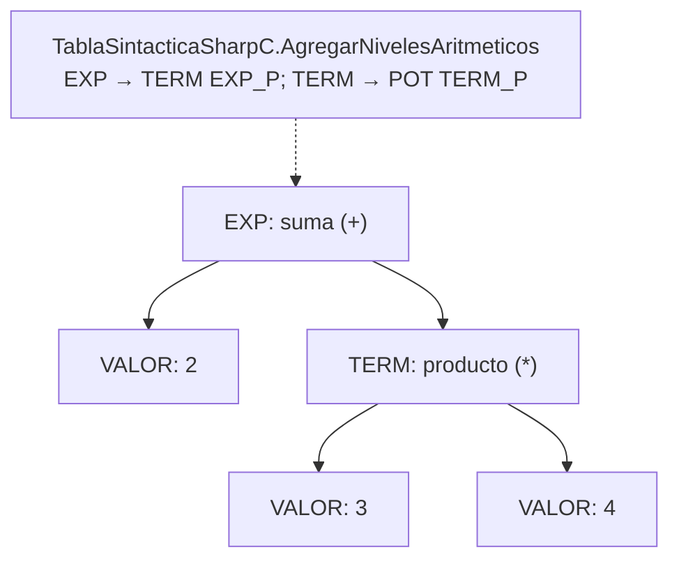
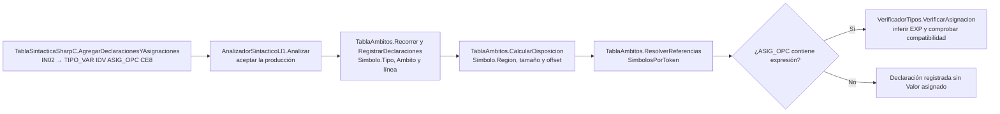
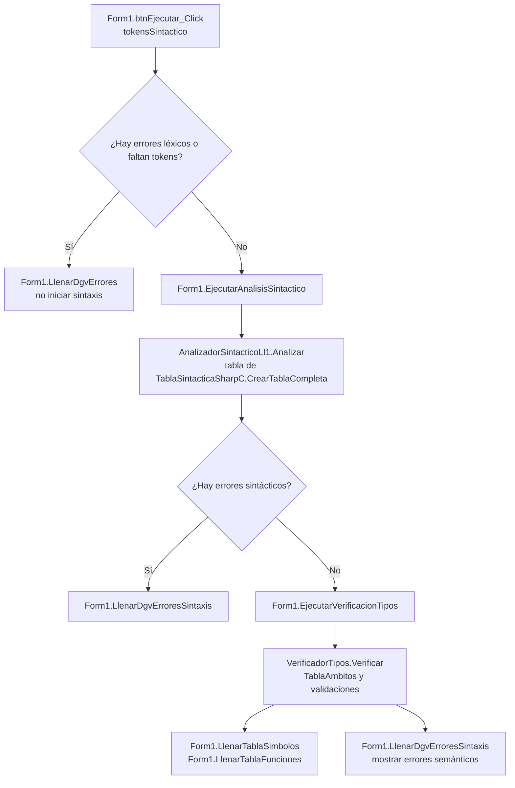
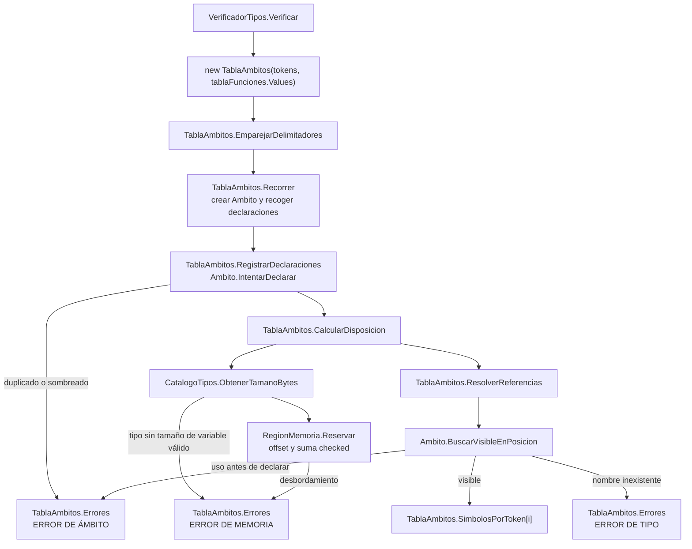
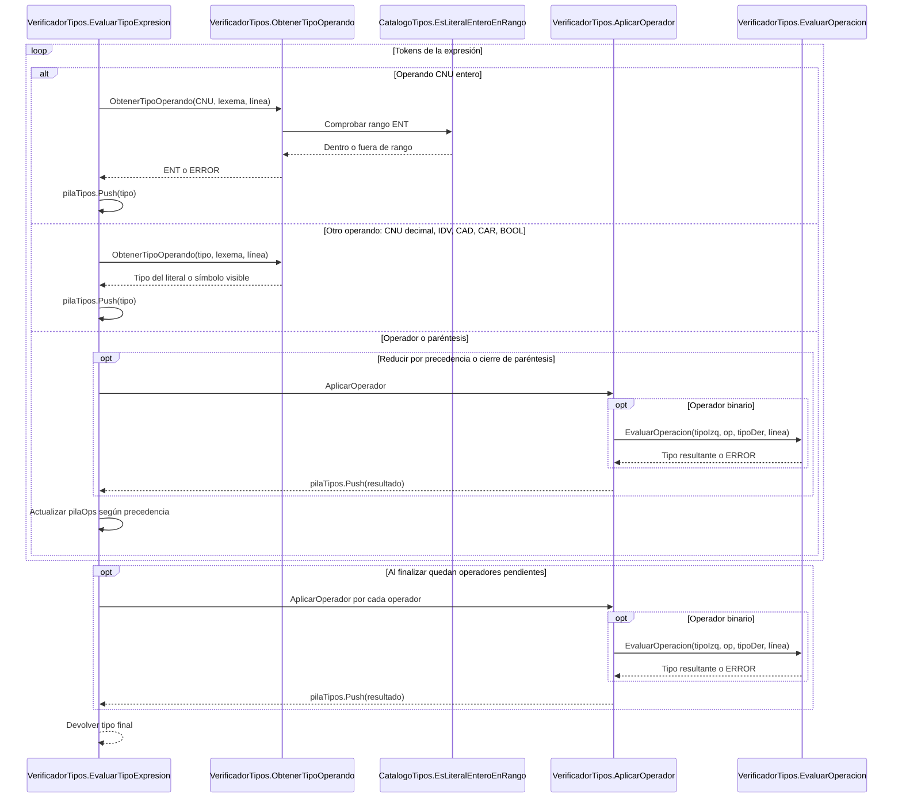
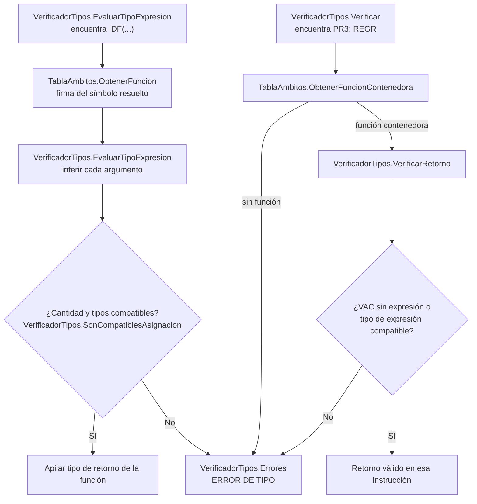
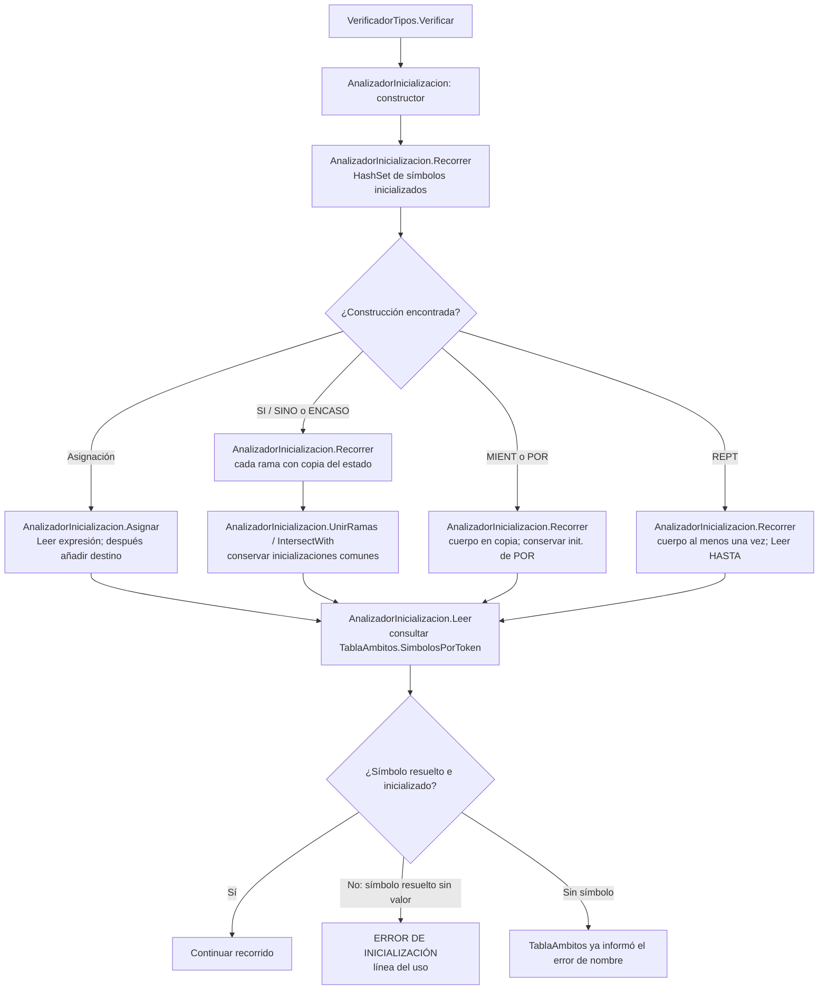
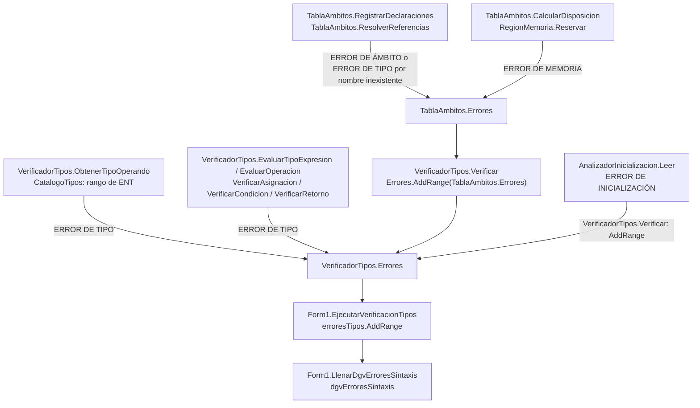

# Analizador léxico, sintáctico y semántico de SharpC

## Índice

1. [Introducción](#introducción)
2. [Antecedentes](#antecedentes)
3. [Aplicaciones](#aplicaciones)
4. [Código](#código)
5. [Resultados](#resultados)
6. [Conclusiones](#conclusiones)
7. [Bibliografía](#bibliografía)
8. [Glosario](#glosario)

## Introducción

El proyecto **AnalizadorLexico2** analiza programas escritos en un lenguaje educativo cuya gramática se implementa en `TablaSintacticaSharpC.cs`. Su propósito es identificar los componentes del código fuente, comprobar su estructura y detectar usos que contradicen las reglas semánticas del lenguaje. Ofrece diagnósticos con número de línea y presenta declaraciones, funciones y errores en una aplicación Windows Forms.

El procesamiento se organiza en tres etapas. El **análisis léxico** separa el texto en lexemas y los clasifica como palabras reservadas, identificadores, números, operadores y otros tokens. El **análisis sintáctico** utiliza una tabla predictiva LL(1) para comprobar si los tokens siguen las producciones de la gramática. Cuando la sintaxis es válida, el **análisis semántico** construye ámbitos, resuelve identificadores, infiere tipos, asigna desplazamientos simbólicos y verifica inicialización, llamadas y retornos.

Una expresión puede ser sintácticamente correcta y, aun así, tener un error semántico. Por ejemplo, `ENT vEdad = "hola";` respeta la estructura de una declaración, pero intenta asignar texto (`TXT`) a una variable entera (`ENT`). Esta diferencia entre *forma* y *significado* es el eje del proyecto.

El sistema realiza **análisis estático**: no ejecuta las instrucciones del programa analizado, no calcula los resultados numéricos de las expresiones y no reserva memoria física para sus variables.

Los bloques `mermaid` de este documento pueden copiarse a [Mermaid Live](https://mermaid.live/) para editarlos o exportarlos. Son diagramas de flujo y de expresión del analizador; no sustituyen el diagrama esquemático de otra materia.

## Antecedentes

### Del autómata al reconocimiento de la gramática

Un compilador o analizador de lenguaje necesita convertir una secuencia de caracteres en unidades reconocibles. En este proyecto, `TokenizadorFuenteSharpC.cs` separa los lexemas y `AnalizadorLexico.cs` consulta una matriz de transiciones cargada desde SQLite para clasificarlos. La salida léxica alimenta el análisis sintáctico.

Las producciones de la gramática se registran en `TablaSintacticaSharpC.cs`. `AnalizadorSintacticoLl1.cs` emplea una **pila de símbolos pendientes** y una tabla de decisión: usa el símbolo en la cima y el token siguiente para elegir una producción. La jerarquía aritmética distingue valores agrupados, potencias, multiplicaciones/divisiones y sumas/restas; las potencias encadenadas se agrupan hacia la derecha.

### Árbol de expresión conceptual

En `2 + 3 * 4`, la multiplicación pertenece al término derecho de la suma. Este árbol **ilustra la agrupación de la gramática**; el programa no crea nodos de árbol en memoria. `TablaSintacticaSharpC.AgregarNivelesAritmeticos` define los niveles y `AnalizadorSintacticoLl1.Analizar` reconoce la secuencia con su pila LL(1).



Así se interpreta `2 + (3 * 4)`. `VerificadorTipos.EvaluarTipoExpresion` conserva esa prioridad para inferir el tipo, sin construir ni evaluar este árbol.

### Significado, ámbitos y atributos

La [lectura sobre la pila semántica](#bibliografía) describe el seguimiento de tipos y resultados parciales. El proyecto utiliza `pilaTipos` y `pilaOps` en `VerificadorTipos.EvaluarTipoExpresion`: una pila guarda **tipos** y la otra operadores; no almacena el resultado numérico de `2 + 3`.

El [material sobre esquemas de traducción](#bibliografía) relaciona reglas gramaticales con acciones que calculan atributos. Aquí esa relación se documenta conceptualmente: primero se acepta la sintaxis y después se recorren los tokens para calcular atributos de símbolos y expresiones. El analizador LL(1) **no construye un árbol sintáctico** ni ejecuta acciones incrustadas en las producciones. La correspondencia entre reglas y métodos se desarrolla en [Acciones semánticas asociadas a la gramática](esquema-traduccion-semantica.md).

**Esquema de traducción conceptual para una declaración (tema 1.5).** La producción `IN02` admite una variable con asignación opcional. Los atributos se obtienen mediante pasadas posteriores, no mediante fragmentos de código insertados en la tabla LL(1).



Los [temas 1.6 y 1.7](#bibliografía) justifican la tabla de símbolos, el alcance, las direcciones y el tratamiento de errores. `TablaAmbitos` relaciona cada uso de un nombre con una declaración concreta; `RegionMemoria` asigna tamaños y desplazamientos relativos a variables y parámetros; `AnalizadorInicializacion` identifica lecturas antes de una asignación definida. La [matriz de cobertura 1.6/1.7](cobertura-errores-1.6-1.7.md) distingue los errores comprobados de los que dependen de una futura ejecución.

## Aplicaciones

1. **Revisión de programas educativos.** Permite detectar errores léxicos, estructuras incompletas, asignaciones incompatibles y condiciones que no producen `BOOL` antes de intentar ejecutar el código.
2. **Consulta de declaraciones y ámbitos.** Ayuda a explicar por qué una variable es visible en un bloque y no en otro, por qué no se admite el sombreado y cómo dos bloques hermanos pueden tener declaraciones homónimas diferentes.
3. **Comprobación de funciones.** Valida la cantidad y los tipos de los argumentos, así como el tipo de cada `REGR` presente; admite la promoción `ENT → DEC` definida por el lenguaje.
4. **Estudio de direcciones simbólicas.** Muestra una región `INI` y marcos independientes por función, con tamaño y desplazamiento por declaración. Esto permite estudiar la disposición de memoria sin representar direcciones reales del sistema operativo.
5. **Demostración de análisis por etapas.** El formulario permite comparar tokens, errores y tablas de símbolos y funciones; las pruebas automatizadas permiten reproducir casos de aceptación y rechazo.

## Código

Los siguientes fragmentos proceden de las clases del proyecto. Se seleccionaron para mostrar cómo se conectan las etapas sin reproducir todos los archivos fuente.

### Análisis sintáctico y semántico

Después de aceptar la sintaxis, `Form1.cs` invoca el verificador y utiliza sus declaraciones para llenar las tablas de la interfaz:



Las tablas semánticas se **llenan** únicamente después de aceptar la sintaxis. Los métodos de presentación también se invocan al final del análisis cuando las tablas están vacías.

```csharp
var verificador = new VerificadorTipos(null);
verificador.Verificar(tokensSintactico);
tablaSimbolos.AddRange(verificador.TablaAmbitos.Simbolos
    .Where(s => s.Clase != "FUNCION"));
tablaFunciones.AddRange(verificador.TablaAmbitos.Funciones);
erroresTipos.AddRange(verificador.Errores);
```

La llamada se realiza únicamente cuando el análisis léxico no ha registrado errores y el sintáctico no ha encontrado errores. Las tablas léxicas de identificadores y las declaraciones semánticas se mantienen separadas.

### Resolución de nombres y tipos

`TablaAmbitos.cs` busca el símbolo visible **en la posición del token**, no solo por el texto de su nombre. Así se diferencia un uso de una declaración posterior incluso si ambos están en la misma línea:

```csharp
Simbolo simbolo = AmbitosPorToken[i]
    .BuscarVisibleEnPosicion(token.Valor, i);
SimbolosPorToken[i] = simbolo;
```

**Construcción de ámbitos y direcciones (temas 1.6 y 1.7).** El constructor de `TablaAmbitos` ejecuta las fases en este orden. Una declaración rechazada genera un error, pero no impide procesar las otras; la memoria se calcula antes de resolver las referencias.



`Simbolo.Region` y `Simbolo.DesplazamientoBytes` describen una dirección relativa; el diagrama no representa una dirección física ni generación de código de acceso.

`VerificadorTipos.cs` permite asignar expresiones del mismo tipo y promocionar `ENT` a `DEC`:

```csharp
if (tipoVariable == tipoExpresion) return true;
if (tipoVariable == "DEC" && tipoExpresion == "ENT") return true;
return false;
```

Además de las asignaciones, se comprueban las operaciones, los argumentos de las llamadas y los retornos. Si una referencia no se resuelve, el tipo `ERROR` se propaga para evitar diagnósticos incompatibles derivados del mismo problema.

**Inferencia de una expresión (tema 1.4).** `pilaTipos` recibe los tipos reconocidos; `pilaOps` retiene operadores hasta que la precedencia o un paréntesis exige combinarlos. Las llamadas `IDF(...)` se procesan recursivamente y se detallan en el diagrama de llamadas posterior.



Una negación `!` se resuelve directamente en `AplicarOperador`; una suma, comparación o operación lógica binaria llega a `EvaluarOperacion`. Si un operando ya es `ERROR`, se propaga sin inventar una incompatibilidad adicional.

**Llamadas y retornos (tema 1.7).** Las expresiones usadas como argumentos se infieren antes de cotejarlas con la firma. Para `REGR`, se busca la función contenedora más cercana, incluso si hay funciones anidadas.



Una llamada sin declaración se informa antes en `TablaAmbitos.ResolverReferencias`. La comprobación de cada `REGR` presente no demuestra que **todos los caminos** de una función no `VAC` retornen.

### Direcciones e inicialización

`RegionMemoria.cs` suma tamaños mediante `checked`. El desplazamiento se fija **antes** de aumentar el total de la región:

```csharp
int siguiente = checked(TamanoBytes + tamanoBytes);
simbolo.Region = this;
simbolo.DesplazamientoBytes = TamanoBytes;
simbolo.TamanoBytes = tamanoBytes;
simbolos.Add(simbolo);
TamanoBytes = siguiente;
```

`AnalizadorInicializacion.cs` mantiene conjuntos de símbolos inicializados. Cuando termina un `SI` con `SINO`, conserva únicamente los símbolos inicializados en ambas ramas. En `MIENT` o en el cuerpo de `POR` no supone que el cuerpo se ejecute alguna vez; el cuerpo de `REPT` se considera ejecutado al menos una vez.

**Inicialización definida (tema 1.7).** Esta fase ocurre al final de `VerificadorTipos.Verificar`, después de la resolución de nombres y de la comprobación de tipos. Un identificador sin símbolo ya fue informado por `TablaAmbitos` y no produce otro error por inicialización.



El estado de las ramas es conservador: no se evalúan constantes para descartar caminos imposibles ni se elimina código inalcanzable después de `REGR`.

**Archivos de referencia:** [`Automatas/AnalizadorLexico.cs`](../Automatas/AnalizadorLexico.cs), [`Automatas/TablaSintacticaSharpC.cs`](../Automatas/TablaSintacticaSharpC.cs), [`Automatas/AnalizadorSintacticoLl1.cs`](../Automatas/AnalizadorSintacticoLl1.cs), [`Automatas/TablaAmbitos.cs`](../Automatas/TablaAmbitos.cs), [`Automatas/VerificadorTipos.cs`](../Automatas/VerificadorTipos.cs), [`Automatas/RegionMemoria.cs`](../Automatas/RegionMemoria.cs) y [`Automatas/AnalizadorInicializacion.cs`](../Automatas/AnalizadorInicializacion.cs).

## Resultados

### Ejemplo de programa válido

```text
INI {
    ENT vA = 2;
    DEC vB = vA + 3.5;
    FUNC DEC fSuma(DEC vDato) {
        REGR vDato + 1;
    }
    DEC vC = fSuma(vB);
}
```

`vA` ocupa 4 bytes simbólicos desde el desplazamiento 0 de `INI`; `vB` ocupa 8 desde el desplazamiento 4 y `vC` otros 8 desde el desplazamiento 12. El total de `INI` es **20 bytes simbólicos**. `fSuma` tiene su propia región: el parámetro `vDato` comienza en 0 y su marco tiene 8 bytes. La expresión `vA + 3.5` es de tipo `DEC`; el analizador almacena el **texto** de la expresión, no el resultado calculado `5.5`.

### Ejemplo de errores detectables

```text
INI {
    ENT vSinValor;
    IMP(vSinValor);
    FUNC ENT fUno(ENT vDato) { REGR vDato; }
    ENT vResultado = fUno("texto");
}
```

En la línea 3 se informa **`ERROR DE INICIALIZACIÓN`** por leer `vSinValor` sin valor asignado. En la línea 5 se informa **`ERROR DE TIPO`** porque el primer argumento de `fUno` debe ser `ENT` y se recibió `TXT`. El número de línea acompaña a cada diagnóstico; en la interfaz los errores semánticos se agregan a `dgvErroresSintaxis`.

**Acumulación y presentación de errores semánticos (tema 1.7).** Cada categoría tiene una fuente concreta. `VerificadorTipos.Verificar` incorpora primero los errores de `TablaAmbitos`, registra los de literales y tipos durante su recorrido y al final agrega los de `AnalizadorInicializacion`.



Cuando el léxico o LL(1) informa un error, este flujo semántico no comienza; sus errores se muestran en los controles correspondientes. La [matriz de cobertura 1.6/1.7](cobertura-errores-1.6-1.7.md) señala los límites de lo que puede conocerse sin ejecutar el programa.

### Comprobación reproducible

La batería documentada en [Pruebas de los analizadores](pruebas-analizadores.md) obtuvo **200 casos correctos, 0 fallidos** con el SDK .NET **10.0.401**. Incluye sintaxis y recuperación, incompatibilidades de tipos, alcance, límites de `ENT`, disposición de memoria simbólica, inicialización y firmas de funciones. El proyecto principal de Windows Forms compiló para **.NET Framework 4.7.2, Debug/x64**.

Las pruebas de consola enlazan las clases reales de análisis, pero clasifican los lexemas de sus ejemplos con un *fixture*: no ejecutan el AFD conectado a SQLite ni comprueban visualmente los `DataGridView`. Las tablas de símbolos y funciones de la aplicación muestran los atributos calculados al analizar programas con el léxico configurado.

## Conclusiones

## Bibliografía

### Documentos de la asignatura

1. *Pila semántica en un analizador sintáctico* (s. f.). [Archivo «1.4_PILA_SEMANTICA (1).pdf»](1.4_PILA_SEMANTICA%20%281%29.pdf), proporcionado para la asignatura.
2. *Esquema de traducción* (s. f.). [Archivo «1.5 Esquema de Traduccion.pdf»](1.5%20Esquema%20de%20Traduccion.pdf), proporcionado para la asignatura.
3. *Generación de la tabla de símbolos y de direcciones; manejo de errores semánticos*, temas 1.6 y 1.7 (s. f.). [Archivo «LyA2_1.6&1.7_Documento.pdf»](LyA2_1.6%261.7_Documento.pdf), proporcionado para la asignatura.

### Documentación técnica del proyecto

4. *Análisis semántico: jerarquía de operaciones, tipos y pilas*. [Documentación interna](analisis-semantico.md).
5. *Ámbitos y declaraciones: integración actual*. [Documentación interna](ambitos-y-declaraciones.md).
6. *Memoria simbólica: regiones y desplazamientos*. [Documentación interna](memoria-simbolica.md).
7. *Cobertura de errores de los temas 1.6 y 1.7*. [Documentación interna](cobertura-errores-1.6-1.7.md).
8. *Pruebas de diagnósticos sintácticos y semánticos*. [Documentación interna](pruebas-analizadores.md).

## Glosario

| Término | Significado en este proyecto |
| --- | --- |
| **Análisis léxico** | Separación y clasificación de lexemas en categorías de tokens. |
| **AFD** | Autómata finito determinista: sus transiciones permiten clasificar un lexema; la matriz de este proyecto se carga desde SQLite. |
| **Lexema** | Fragmento concreto de texto leído del programa, por ejemplo `vEdad` o `12`. |
| **Token** | Categoría asignada a un lexema, por ejemplo `IDV` para una variable o `CNU` para un número. |
| **Análisis sintáctico** | Comprobación de que la secuencia de tokens sigue la gramática del lenguaje. |
| **LL(1)** | Método predictivo que analiza de izquierda a derecha y decide una producción consultando un token de anticipación y una tabla. |
| **Árbol de expresión** | Representación conceptual de cómo se agrupan operadores y operandos según precedencia y paréntesis. El analizador actual **no construye** ese árbol como objeto. |
| **Análisis semántico** | Comprobación del significado estático: tipos, declaraciones visibles, inicialización, llamadas y retornos. |
| **Pila semántica** | En este proyecto, `pilaTipos`: almacena tipos de operandos y resultados parciales durante la inferencia. `pilaOps` guarda los operadores pendientes. |
| **Ámbito** | Región léxica de visibilidad de una declaración. `INI` es el ámbito principal; bloques y funciones crean ámbitos hijos. |
| **Tabla de símbolos** | Registro de declaraciones con nombre, tipo, clase, ámbito, línea y, cuando corresponde, región y desplazamiento. |
| **Resolución de nombres** | Proceso que vincula un uso de identificador con la declaración visible correcta. |
| **Tipo de dato** | Clasificación de un valor del lenguaje, por ejemplo `ENT`, `DEC`, `BOOL`, `CAR`, `TXT` o `VAC` como retorno sin valor. |
| **Promoción de tipos** | Compatibilidad que permite utilizar un `ENT` donde se espera un `DEC`. |
| **Inicialización definida** | Propiedad de una variable que recibió una asignación antes de ser leída en todos los caminos considerados. |
| **Firma de función** | Nombre, tipo de retorno y tipos de los parámetros utilizados para comprobar una llamada. |
| **Región de memoria** | Área *simbólica* independiente para `INI` o para el marco de una función; no es una dirección física. |
| **Desplazamiento u offset** | Posición relativa en bytes de una variable dentro de su región. |
| **Error semántico** | Uso válido en su forma sintáctica que infringe una regla de significado, como asignar texto a `ENT` o leer una variable sin inicializar. |
